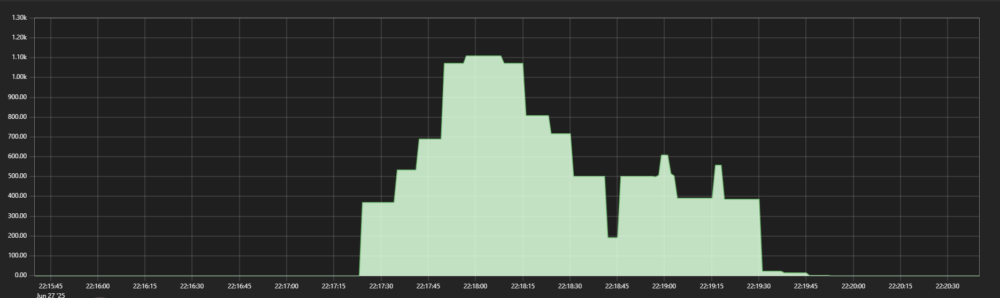

# Monitoramento com Prometheus:
Estudo sobre o funcionamento básico do Prometheus.

* Aplicação básica em node.js rodando na máquina local;
* Prometheus rodando em um container Docker;
* Simulação de requisições via ApacheBench;
* Visualização de gráfico na interface do Prometheus;

## Visualização de gráfico:

* promQL query utilizada: `increase(request_total[1m])`

* Comando ApacheBench utilizado: `while true; do ab -n 100 -c 5 http://<IP_da_sua_maquina>:3000/; sleep 5; done`

#
repositório ainda será refinado e ajeitado
